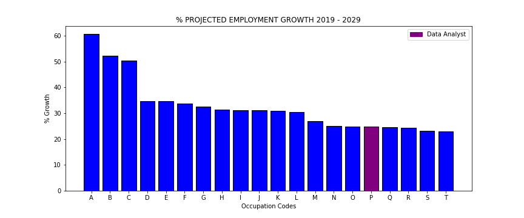
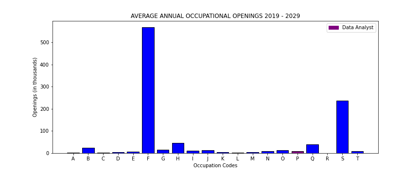

# Andrew Ingrassia | *Project Summary*

**PROJECT CONTENTS**

- **bls_projections.csv**: CSV file from the US Bureau of Labor Statistics containing data related to 2019 - 2029 occupational projections

- **bls_growth.csv**: A cleaned version of "bls_projections.csv" containing only data relevant to this project

- **career_analysis.ipynb**: Jupyter Notebook containing an overview of the BLS dataset, as well as my efforts to clean the data, generate visualizations, etc.

- **personal_info.ipynb**: Jupyter Notebook containing personal information (my educational background, why I chose to pursue data analysis, etc.)

- **growth.png** & **openings.png**: Saved images of the data visualizations generated in "career_analysis.ipynb" (difficult to see in dark mode)

***

**PROJECT GOALS**

- Investigate the demand for data analysts using data from the US Bureau of Labor Statistics (the principal fact-finding agency for the US government in the broad field of labor economics and statistics).

- Demonstrate a basic understanding of data analysis tools, concepts, and techniques.

- Practice my newly acquired data analysis skills by putting them to use in the context of a real-world project of personal significance.

- Describe the circumstances that led me to pursue a career in data analysis.

- Convey my suitability for a career in data analysis.

***

**OVERVIEW**
- Of the 790 occupation categories from the original BLS dataset, the 20 included in this study are the ones projected to experience the highest percentage of employment growth between 2019 and 2029.

- Data Analyst ("P") ranks 16th out of the original 790 categories.

- Notice, however, that a high percentage of employment growth doesn't necessarily translate to a large number of annual opening.

- Some industries are smaller than others. For example, the projected 60.7% increase in wind turbine maintenance related employment growth ("A") represents only 
1,300 annual openings, whereas the projected 22.9% increase in service unit operation related employment growth ("T") represents 8,100 annual openings.

- Some industries also have higher turnover rates. For example, the projected increase in home health related occupational openings ("K") is significantly larger 
when compared to the other occupational categories in the top 20 - but the home health industry also has one of the highest turnover rates in the country 
(https://www.vox.com/the-highlight/2019/8/21/20694768/home-health-aides-elder-care).

***

**INSIGHTS**

- Data analysis related careers are in high demand, and that demand is projected to increase between now and 2029.

- The median annual wage for data analysts is $86,200.
